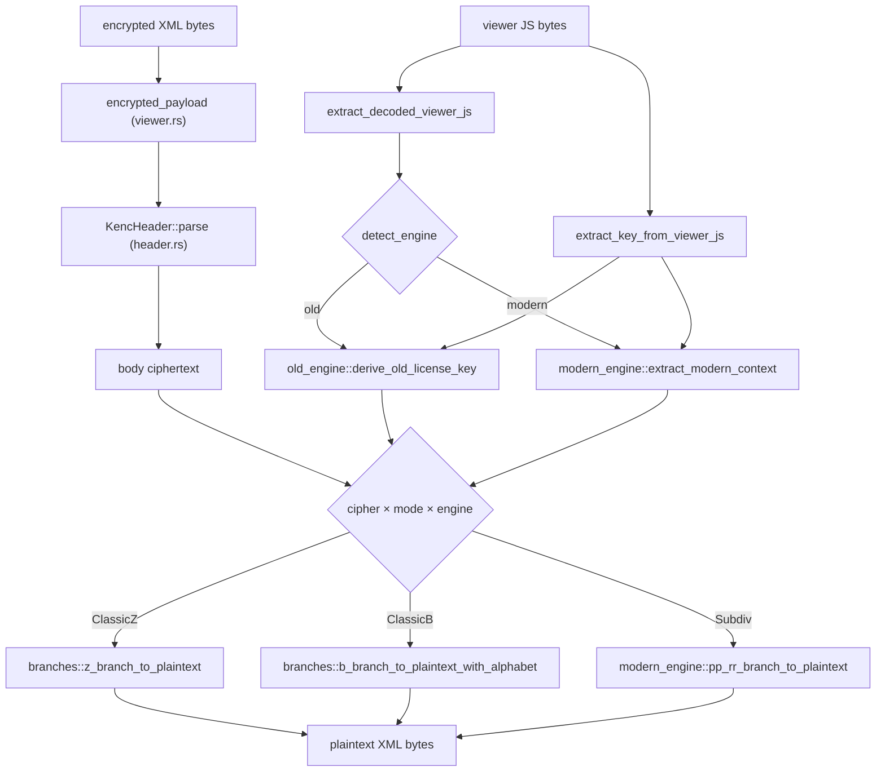

# Architecture — `krpano-decrypt`

This document describes the architecture of the `krpano-decrypt` toolkit: how
the Rust library is structured, how the pieces map to the reverse-engineered
format, and how the dynamic analysis tools and reference JavaScript fit in.

> **Format reference.** The implementation-independent description of the
> encrypted krpano format lives in [`PLAN.md`](./PLAN.md). Sections in this
> document link to the corresponding `PLAN.md` sections (`§N`). Read `PLAN.md`
> first; this file explains *how the code realizes it*.

---

## 1. Repository layout

```
krpano-decrypt/
├── Cargo.toml                 # workspace root (library + CLI)
├── crates/
│   ├── krpano-decrypt/        # the reusable library crate
│   │   └── src/
│   │       ├── lib.rs         # public API: decrypt_xml, inspect, re-exports
│   │       ├── error.rs       # KrpanoDecryptError (one variant per stage)
│   │       ├── header.rs      # KencHeader, BodyCipher, CipherMode     §2.2
│   │       ├── codecs.rs      # Modified Base85, LZ4 block              §3.1
│   │       ├── crypto.rs      # RC4-like byte decryptor                 §4.1
│   │       ├── viewer.rs      # packed-viewer decode + wrapper key      §3.1, §3.3–3.4
│   │       ├── old_engine.rs  # old engine key derivation               §3.3
│   │       ├── modern_engine.rs # modern engine key extraction          §3.4
│   │       ├── branches.rs    # ClassicZ / ClassicB / Subdiv bodies     §4.2–4.4
│   │       └── engine.rs      # detect_engine + decrypt_xml dispatch    §3.5, §5
│   └── krpano-decrypt-cli/    # the `krpano-decrypt` binary
│       └── src/main.rs        # clap CLI: decrypt / decode-viewer /
│                               #              wrapper-key / inspect
├── testdata/encrypted/        # fixture corpus (one dir per tour)       §7
├── reference/                 # deobfuscated JS functions (see §4)
├── tools/                     # dynamic analysis tools (see §5)
├── PLAN.md                    # format documentation (implementation-free)
├── AGENTS.md                  # this file
└── README.md                  # high-level overview
```

The workspace splits the **library** (`krpano-decrypt`) from the **CLI**
(`krpano-decrypt-cli`) so that depending on the library does not pull in CLI
dependencies (`clap`, `anyhow`, `env_logger`).

---

## 2. The decryption pipeline (end to end)

`decrypt_xml(contents, viewer_data)` ([`engine.rs`](./crates/krpano-decrypt/src/engine.rs))
is the single entry point. It mirrors the pipeline in [PLAN.md §3.5](./PLAN.md):



### 2.1 Stage ownership

| Stage | Module | PLAN.md | Notes |
|-------|--------|---------|-------|
| Extract `<encrypted>` payload (CDATA concat) | `viewer.rs` | §2.1 | Regex over the XML text. |
| Parse 8-byte `KENC....` header | `header.rs` | §2.2 | Cipher + mode from bytes 4 & 6, base 80. |
| Decode packed viewer (Base85 → LZ4) | `codecs.rs` + `viewer.rs` | §3.1 | Big- or little-endian, validated by LZ4 header. |
| Extract `krp:`/`ptp:` wrapper string | `viewer.rs` | §3.1 | Scan JS string literals by prefix. |
| Detect engine family | `engine.rs` | §3.2 | Markers: `KENC`, `b64u8`, `we.subdiv`. |
| Old engine key derivation | `old_engine.rs` | §3.3 | Unpack wrapper → `_[]` rows + license blob; `case 7` protected key; constructed-alphabet evaluator. |
| Modern engine key extraction | `modern_engine.rs` | §3.4 | Startup-IIFE locate + checksum + `lf` shuffle + `krp:` unpack → `we.subdiv` rows + side data. |
| ClassicZ body | `branches.rs` | §4.2 | Base85 → RC4 (`crypto.rs`) → LZ4 → UTF-8. |
| ClassicB body | `branches.rs` | §4.3 | Custom Base64 → RC4 → UTF-8. |
| Subdiv body | `modern_engine.rs` | §4.4 | Token replace → `we.subdiv` branch 5 (PP / RR-2023 / RR-1.24 paths). |

### 2.2 Dispatch table

`decrypt_xml` matches on `(BodyCipher, CipherMode, EngineFamily)`. Every
supported combination is an explicit arm; anything else returns
`UnsupportedCombination`. See [PLAN.md §2.2](./PLAN.md) for the observed
combinations and [§6](./PLAN.md) for the resolved/unresolved variants.

---

## 3. Reverse-engineering principles

These principles are baked into the code and must be preserved when extending
support to new krpano versions:

1. **No JavaScript execution.** Keys are recovered by *static analysis* of the
   decoded engine source. The engine is never evaluated. This keeps decryption
   deterministic, sandbox-free, and safe on untrusted input. (`PLAN.md §9`)

2. **Value-based row identification.** Row extraction never relies on per-build
   minified identifiers or hardcoded row indices. It searches by stable
   semantic values observed across engine versions — `"actions overflow"`
   (default key), `"krpano"` (branch-5 constants). Subdiv bodies use `z` as a
   fixed escape marker. This is what lets the same code decrypt engines from
   2018 through 2026.

3. **Structural, not textual, pattern matching.** The startup IIFE is located
   by brace matching + numeric-literal extraction, not by a fixed regex. The
   constructed-alphabet path locates the Base64 decoder by *behavioral
   signature* (`indexOf` + `charAt` + bit manipulation) and evaluates the
   construction expression with a name-agnostic recursive-descent parser.

4. **i32 arithmetic for JS fidelity.** All wrapper-unpacking and branch-5
   arithmetic uses 32-bit signed wrapping (`wrapping_*`, `rem_euclid`) to match
   JavaScript's `ToInt32` semantics exactly. Bitwise shifts are masked to 5
   bits. This is load-bearing — using `i64`/`u32` naively produces wrong keys.

5. **Safe fallbacks.** Where an auxiliary datum (e.g. the ClassicB alphabet)
   may be absent in some engine subfamily, the code falls back through a ranked
   list of sources. A wrong fallback produces non-UTF-8 / non-XML output that
   the pipeline rejects, so fallbacks cannot yield false positives.

---

## 4. Reference JavaScript (`reference/`)

`reference/` contains **checked-in, deobfuscated** versions of the most
important krpano JavaScript functions, with meaningful variable names and
comments. These are *not* executed; they exist to:

- document the obfuscated algorithms in their original language, and
- serve as a ground-truth cross-check when porting behavior to Rust.

Each file names the engine version it was extracted from and the Rust module
that implements the same logic:

| Reference file | Implements | Rust module |
|----------------|------------|-------------|
| `rc4_byte_decryptor.js` | RC4-like byte decryptor (key-mix prefix, KSA, 256-byte discard, PRGA) | `crypto.rs` |
| `modified_base85.js` | 5-char → 32-bit modified Base85 decode (BE + LE) | `codecs.rs` |
| `lz4_block.js` | krpano LZ4 block decompression (8-byte header) | `codecs.rs` |
| `old_wrapper_unpack.js` | Reverse-substitution wrapper unpack (`_[]` rows + license blob) | `old_engine.rs` |
| `modern_krp_unpack.js` | Startup IIFE: checksum, `lf` shuffle, `krp:` → `we.subdiv` rows + side | `modern_engine.rs` |
| `subdiv_branch5.js` | `we.subdiv` branch-5 decompressor (PP + RR-2023 + RR-1.24) | `modern_engine.rs` |

When a new krpano version is discovered, the workflow is: run the dynamic tools
(§5) to extract the new obfuscated functions → deobfuscate into `reference/` →
diff against the existing reference to find what changed → port the delta into
the Rust module → add a fixture + test.

---

## 5. Dynamic analysis tools (`tools/`)

Unlike the library, these tools **do execute krpano JavaScript** in a
controlled environment (Node.js or a headless browser) and instrument it. They
are the bridge between a new obfuscated `tour.js` and a clean `reference/`
implementation. They never run inside the decryption library.

### 5.1 Node tools (`tools/`)

- **`decode_viewer.mjs`** — replicates the library's packed-viewer decode in
  JS, so the decoded engine can be inspected independently of Rust. Writes
  `decoded.js` for a fixture.
- **`extract_modern_rows.mjs`** — loads the decoded engine in a sandbox, hooks
  the `we.subdiv` closure, and dumps every row as `rows.json` (id → hex). The
  Rust tests cross-check the static extractor against this JSON.
- **`trace_decrypt.mjs`** — instruments the live `decryptData`/branch-5 path,
  logging every intermediate value (key derivation, RC4 state, branch-5 keys).
  Used to debug a fixture that the Rust port fails on by comparing trace logs.
- **`dump_engine.mjs`** — pretty-prints the decoded engine and greps for
  version markers, helper signatures, and the startup IIFE.

### 5.2 Browser tool (`tools/browser/`)

- **`instrument.html`** — loads a real krpano viewer in a browser, intercepts
  `XMLHttpRequest`/`fetch` to feed a chosen encrypted XML, and records the
  arguments and return values of the internal decrypt entry points. Useful for
  catching behavior that only manifests at runtime (e.g. 1.20+ key embedding).

> **Safety.** The dynamic tools run real, third-party krpano code. Run them on
> fixtures you control, not on arbitrary untrusted tours.

See `tools/README.md` for per-tool usage and prerequisites.

---

## 6. Testing strategy

- **Fixture-driven.** `testdata/encrypted/` holds one directory per real tour
  (27 fixtures spanning 2013–2026). Tests iterate every directory that has both
  an XML and a JS, decrypt end-to-end, and assert valid XML. When a
  `plaintext.xml` golden file is present, the test asserts a byte-for-byte
  match (CRLF-normalized for cross-platform CI).
- **Stage tests.** Each module has unit tests pinning its stage: header
  classification, Base85/LZ4 round-trips, wrapper-key lengths, decoded-engine
  lengths, checksum constants, protection-key extraction, etc.
- **JSON cross-check.** `modern_engine` tests compare the static Rust extractor
  against `rows.json` produced by `tools/extract_modern_rows.mjs` to catch
  drift between the JS ground truth and the Rust port.
- **Probe harnesses.** `#[ignore]`d tests (`analysis_harness_prints_all_stages`,
  `probe_external_repos`, env-var `KRPANO_PROBE_XML`/`KRPANO_PROBE_JS`) let
  developers triage new tours without writing new code.

---

## 7. Extending to a new krpano version

1. Add the tour to `testdata/encrypted/<date>-<variant>/`.
2. Run `tools/decode_viewer.mjs` and `tools/extract_modern_rows.mjs`; inspect
   the decoded engine and `rows.json`.
3. If a marker changed, update `detect_engine` (`engine.rs`) and the relevant
   extractor. Prefer a new *value-based* search over a hardcoded id.
4. If branch 5 or the wrapper-unpack changed, diff the obfuscated function
   against `reference/` and port the delta into `modern_engine.rs` /
   `old_engine.rs`, preserving the i32 arithmetic.
5. Add the fixture to the metadata tables in `engine.rs` tests and the
   `PLAN.md §7` corpus table. Add a `plaintext.xml` golden if possible.
6. `cargo test` must stay green; CI runs it on every push.

---

## 8. CI

`.github/workflows/ci.yml` runs `cargo fmt --check`, `cargo clippy`, `cargo
test`, and a Node step for the dynamic-analysis tool smoke tests (`tools/`).
The test suite is self-contained: no network, no external repos required.
