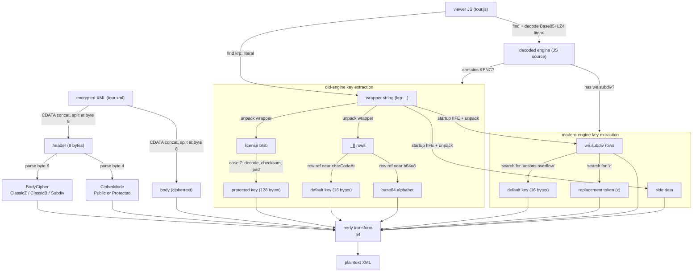

# krpano Encrypted Tour XML — Format Notes

Reverse-engineered from fixtures and engine source analysis.

---

## 1. The two input files

An encrypted krpano tour consists of two files that appear together on the page:

| File | Role |
|------|------|
| Encrypted XML, commonly `tour.xml` | A `<krpano>` document containing an `<encrypted>` element with the ciphertext. |
| Viewer JS, commonly `tour.js` or `krpano.js` | The krpano player. The decoded engine source (never executed) holds the keys. |

The XML specifies the **transform**; the JS provides the **key**.

---

## 2. The encrypted XML

### 2.1. XML structure

```xml
<krpano>
  <encrypted><![CDATA[KENC....abc...]]><![CDATA[def...]]></encrypted>
</krpano>
```

The `<encrypted>` element's text content may split across multiple CDATA sections (and may include non-CDATA text nodes). All text content is concatenated into a single string — without trimming or normalizing beyond standard XML parsing — to form the encrypted payload.

The payload consists of an 8-byte ASCII **header** followed by a **body**. A payload shorter than 8 bytes, or not starting with `KENC`, is treated as unencrypted XML.

### 2.2. The KENC header

The first 8 bytes begin with `KENC`. The remaining four bytes are:

| Offset | 0 | 1 | 2 | 3 | 4 | 5 | 6 | 7 |
|--------|---|---|---|---|---|---|---|---|
| Byte   | K | E | N | C | mode | U | cipher | R |

Bytes 5 and 7 are `U` and `R` in every observed fixture. Their purpose is not yet determined; they do not affect the cipher/mode dispatch.

The two meaningful fields are decoded with arithmetic relative to the constant **80** (derived in the engine as `k = (r<<4)+(r<<2)` with `r=4`):

**Cipher mode** (byte 4) — whether a license-derived key is needed:

| Char | `(charCode - 80) >> 1` | Meaning |
|------|------------------------|---------|
| `P` | 0 | **Public** — no license key |
| `R` | 1 | **Protected** — license key required |

`U` (`charcode('U') = 85`, result `2`) also appears in old-engine switch cases, but no observed fixture has `U` in byte 4.

**Body cipher** (byte 6) — which pipeline decrypts the body:

| Char | `charCode - 80` | Pipeline |
|------|-----------------|----------|
| `Z` | 10 | **ClassicZ** — Modified Base85 → RC4 → LZ4 → UTF-8 |
| `B` | -14 | **ClassicB** — Custom Base64 → RC4 → UTF-8 |
| `P` | 0 | **Subdiv** — Token replacement → `we.subdiv` branch 5 |
| `R` | 2 | **Subdiv** — Same pipeline; public vs protected is encoded inside the body |

The header fields parse independently, following the grammar:

```text
KENC <mode> U <cipher> R
mode   := P | R
cipher := Z | B | P | R
```

Observed combinations:

| Header | Cipher | Mode | Observed engine |
|--------|--------|------|----------------|
| `KENCPUZR` | ClassicZ | Public | modern |
| `KENCRUZR` | ClassicZ | Protected | old |
| `KENCPUBR` | ClassicB | Public | old |
| `KENCRUBR` | ClassicB | Protected | old (1.19-pr3) and transitional (1.19-pr16.1) |
| `KENCPUPR` | Subdiv | Public | modern (<=1.21) |
| `KENCRURR` | Subdiv | Protected | modern (<=1.21) |

Note: KENCRUBR is fully decrypted across both observed engine families — see §4.3 and §6.2.

---

## 3. The viewer JS

### 3.1. Two layers of packing

The viewer JS file contains a long string literal that decodes in two stages:

1. **Modified Base85** — groups of 5 characters decode to a 32-bit integer. Big-endian in pre-1.24 engines, little-endian in 1.24. The correct endianness is determined by validating the resulting LZ4 header.
2. **LZ4 block** — the decoded bytes form an LZ4-compressed block with an 8-byte header: 3-byte LE decompressed length at offset 0, 3-byte LE compressed length at offset 4. Bytes 3 and 7 appear unused in observed fixtures. This is a krpano-specific header, not a standard LZ4 frame.

The decompressed result is the **decoded engine** — the raw krpano JavaScript source. Keys are extracted by static analysis of this source; it is never executed.

The same file also contains a second string literal: the **wrapper string**, starting with `krp:`. In the page HTML this string is the argument to `embedpano`. It is a payload from which keys are derived; it is not itself a key.

### 3.2. Engine families

The decoded engine belongs to one of two families, distinguished by how it stores decryption constants:

**Old engines** (observed 2013–2017) — the source contains the literal substring `KENC`. Constants live in a numeric `_[]` string table unpacked from the wrapper string. The Base64 decoder function `b64u8=function` is present.

**Modern engines** (observed 2018+) — the source does NOT contain literal `KENC`. Constants are reconstructed from a closure (`we.subdiv` in engines ≥2019) or an IIFE (in transitional 1.19-pr16 engines), populated at startup by key-unpacking logic.

**Transitional engines** (krpano 1.19-pr16 era) — these use the modern Base85+LZ4 packing format but lack the `we.subdiv` closure. They are classified as Modern by detection (`detect_engine` looks for old-engine markers and defaults to Modern), but key extraction must use an alternative IIFE path (not `we.subdiv`). The observed transitional fixture (2018-04-23) decrypts via the modern-ClassicB dispatch arm: a standard RFC 4648 Base64 alphabet (no custom alphabet is embedded) and a `case 7`-derived `pk=` key (§4.3).

### 3.3. Old engine key extraction

The wrapper `krp:` string is an obfuscated payload. Unpacking it (reverse-substitution cipher with a per-fixture salt and rolling checksum) yields two data structures:

- **`_[]` rows** — a table of pipe-delimited string records.
- **License blob** — a Base64-encoded string interleaved between the rows.

**Protected key.** In observed fixtures, one `_[]` row contains license field tags (e.g. `xx=lz=rg=ma=...=ek=...`). A tag ending with `=` (typically `ek=`) names a field within the license blob. The engine's `pc.init` function processes this field in the `case 7` arm of a switch statement: it Base64-decodes the value, validates a `ck=` checksum, maps each resulting byte through `charCodeAt(i) & 255`, and pads the result to 128 bytes by cycling. This 128-byte string is the protected key.

**Default key and Base64 alphabet.** The ClassicB cipher requires a default key and a custom Base64 alphabet. Both are rows in the `_[]` table. The extraction mechanism searches the decoded engine near helper functions for `_[N]` references:

- **Default key**: found by searching backward from `String(e).charCodeAt` (or `String(h).charCodeAt`) for `_[N]`.
- **Base64 alphabet**: the `b64u8` function (e.g. `function(d){return g(a(d))}`) delegates to helper functions (`g`, `a`) where the `_[N]` reference lives. The extraction traces through these helpers to find the alphabet row index. As a fallback, `_[]` rows are scanned for a 65-character string starting with `ABCDEFGHIJKLMNOPQRSTUVWXYZ`.

Some engines do not store the alphabet as a single `_[N]` row. Instead they build it at runtime from several `_[N]` rows and string transforms, e.g. `var w=_[183], w=w+(F(w)+_[273])` where `F(a){return(""+a).toLowerCase()}` yields `_[183] + lowercase(_[183]) + _[273]`. The extractor handles this by locating the Base64 decode function via its behavioral signature (`indexOf` + `charAt` + bit manipulation), following the alphabet variable back to its assignment(s), and evaluating the construction expression against the unpacked `_[]` rows with a name-agnostic recursive-descent evaluator (`find_constructed_alphabet`). This generalises to permuted (non-standard) constructed alphabets.

### 3.4. Modern engine key extraction

Modern engines do not store keys in the source text. Instead, a startup IIFE reconstructs them at startup by unpacking the wrapper string:

1. Compute a checksum of the wrapper string. The checksum constant varies by engine subfamily (observed values: 22248, 22557, 23293). The IIFE is found structurally by identifying `(function …){…}` blocks that contain numeric literals.
2. Build a shuffle array from the engine's browser-name table (`Ma`, where `Ma[1]` is observed as `"Android Browser"`).
3. Unpack the wrapper string into `we.subdiv` rows and **side data** — semicolon-separated key=value records (Base64-decoded then decoded as krpano-modified UTF-8).

After unpacking, calls like `_("<id>")` read rows from the `we.subdiv` closure. All rows are searched **by value**:

| Searched value | Becomes |
|---------------|---------|
| `"actions overflow"` | Default key (16 bytes, used by ClassicZ in Public mode) |
| `"z"` | Replacement token (used by Subdiv cipher) |

In all observed modern engines, the default key resolves to `"actions overflow"` and the replacement token to `"z"`, even though the row IDs differ across versions.

### 3.5. Pipeline overview

With all concepts defined, here is the full decryption pipeline. Rectangles are data; arrow labels are the algorithms that produce or consume them.



The dispatch node represents the three body ciphers: ClassicZ (Base85 → RC4 → LZ4 → UTF-8), ClassicB (Base64 → RC4 → UTF-8), and Subdiv (token replace → `we.subdiv` branch 5). Each is described in §4.

---

## 4. The body ciphers

With the header (cipher + mode) and the key, the body can be decrypted.

### 4.1. Shared building block: the RC4-like byte decryptor

The ClassicZ and ClassicB ciphers both use a modified RC4. It operates in four phases:

**Phase 1 — Key mixing.** The first 128 bytes of ciphertext are interleaved with key bytes to initialize the first half of a 256-entry state array. The second half (entries 128–255) is initialized to sequential values:

```text
for i = 0; i < 128; i++:
    state[i] = (key[i & key_mask] ^ ciphertext[i]) & 255
for i = 128; i < 256; i++:
    state[i] = i
```

**Phase 2 — KSA.** The full 256-byte state is shuffled:

```text
j = 0
for i = 0; i < 256; i++:
    j = (j + state[i] + key[i & key_mask]) & 255
    swap(state[i], state[j])
```

**Phase 3 — Discard.** The first 256 bytes of the PRGA keystream are generated and thrown away (i and j carry forward from KSA).

**Phase 4 — Decrypt.** Starting from offset `encrypted_start = 128 + (ciphertext[65] & 7)`, each remaining ciphertext byte is XORed with the keystream. Bytes before `encrypted_start` are key-mix material and are not emitted as output.

The `key_mask` is 15 for the default 16-byte key. The engine widens it via `f |= f << 3`, giving 127. When a key index exceeds the key string, JavaScript's `charCodeAt` returns `NaN`, which is coerced to 0 by the bitwise operations used in the KSA.

The index 65 used in `encrypted_start` appears in engine source as `Ma[1]`, not as a literal constant. The mask for the `ciphertext[65] & 7` computation is always 15 in observed engine source, regardless of the key mask.

### 4.2. ClassicZ

Pipeline: **Modified Base85 → RC4 decrypt → LZ4 decompress → UTF-8**.

The body is modified-Base85 text. Decoding yields raw bytes. After RC4 decryption (using the key-mix prefix and discarding bytes before `encrypted_start`), the emitted decrypted payload is an LZ4-compressed block with an 8-byte header (same format as the packed viewer). After LZ4 decompression, the result is UTF-8 XML.

| Mode | Key used |
|------|---------|
| Public (observed only with modern engines) | Modern engine's default key (`"actions overflow"`, 16 bytes, mask 15) |
| Protected (observed only with old engines) | Old engine's protected key (128 bytes, widened mask 127) |

Proven vector (2018-04-04 fixture, Public): 9,915-char body → 7,932 bytes Base85 → 7,803 emitted decrypted bytes after dropping key-mix prefix → 36,407 bytes plaintext XML.

### 4.3. ClassicB

Pipeline: **Custom Base64 → RC4 decrypt → UTF-8**.

The body is decoded with a custom Base64 alphabet, then run through the RC4-like byte decryptor (§4.1), then interpreted as UTF-8. The alphabet is engine-supplied and is not standard RFC 4648 unless it happens to match.

**Alphabet sources (tried in order, old and modern/transitional engines):**

1. The `_[]` row referenced near the `b64u8` helper (traced through the helper functions `b64u8` calls).
2. A `_[]` row scan for a 65-char string starting with `ABCDEFGHIJKLMNOPQRSTUVWXYZ`.
3. A literal in the decoded engine source (quoted string or `String.fromCharCode(...)`).
4. A **constructed alphabet**: built at runtime from several `_[]` rows and string transforms (e.g. `_[N] + lowercase(_[N]) + _[M]`). The extractor parses and evaluates the construction expression against the unpacked rows (`find_constructed_alphabet`). Observed in krpano 1.19-pr3.
5. Standard RFC 4648 Base64 (final fallback for modern/transitional engines that embed no custom alphabet). Observed in krpano 1.19-pr16.

**Key:**

| Mode | Engine | Key |
|------|--------|-----|
| Public | old | Old engine's default key (16 bytes, the `_[]` row referenced near `String(e).charCodeAt`) |
| Protected | old | Old engine's protected key: the license-blob field value, `charCodeAt & 255`, padded to 128 by cycling (`case 7`) |
| Protected | transitional/modern | The `pk=` side-record value, `charCodeAt & 255`, padded to 128 by cycling (`pad_key_string_to_128`) — the same `case 7` derivation; the value is NOT re-base64-decoded because `side_records` already decoded the side-data blob |

Fixtures: `2013-06-05-B`, `2013-08-09-B` (Public, old); `2015-08-04-KENCRUBR` (Protected, old 1.19-pr3); `2018-04-23-KENCRUBR` (Protected, transitional 1.19-pr16).

### 4.4. Subdiv

This cipher uses the `we.subdiv` branch-5 decompressor instead of RC4.
It appears in modern engines (2023+) with two key-mixing strategies depending
on the engine version.

**Body format:**

1. Replace every occurrence of the replacement token (`"z"`) with `0x5C`
   (backslash). The token is extracted from a `we.subdiv` row whose value is
   `"z"`. In the Subdiv body encoding, `"z"` serves as an escape marker.
2. The first two bytes after replacement determine the mode and engine version:
   - `%*` (37, 42) = public (all engines)
   - `&*` (38, 42) = protected, 2023/2024 engines
   - `$*<key-id>@...` (36, 42) = protected, 1.24+ engines
3. Compute `f = d[0] - g` where `g = row[5] / 3` from the `"krpano"` row.
   - `f = 0` — public (no key mixing)
   - `f = 1` — protected, 2023/2024 key-mix path
   - `f = -1` — protected, 1.24 key-mix path (with key-ID prefix at body[3..])

**Branch 5 decompressor (shared):**

All Subdiv bodies are decompressed by `we.subdiv` branch 5. Constants are
computed from the `"krpano"` row (e.g. `g = 111 / 3 = 37`):
`h = body[1] - g`, `v = h + 2`, `q = (v*h + h) / h`,
`T = v + h*2`. From these: `W = T*T*h`, `P = W*T*h`,
`coeff_B = P*h*h`, `coeff_F = coeff_B*v*h`,
`coeff_X = (P + W)*(g - 2) + 2*v*(g + v - 1)`,
`coeff_C = P*3 / W`.

Keys are read from `stream..stream+2*g` as
`coeff_B * body[i] * v + (body[i+1] - g + h) * W` (37 keys).
Compressed data follows. Decompression processes 5 input bytes per 4 output
bytes, cycling through the 37 keys. Arithmetic uses signed 32-bit wrapping.
After decompression the output is krpano-UTF-8-decoded: skip leading zeros,
skip BOM, reconstruct 3-byte sequences with JS length-extension semantics.

**Stream offset:**

| Mode | Engine | f | Stream start | Keys at | Compressed at |
|------|--------|---|-------------|---------|---------------|
| Public | all | 0 | 2 | 2 | 2*(1+g) = 76 |
| Protected | 2023/24 | 1 | 2 | 2 | 2*(1+g) = 76 |
| Protected | 1.24 | -1 | 2+1+c | k | k + 2*g |

Where `c = body[2] - g - (T + q)` (18 for rr_minimal). The stream start
`k = 2 + 1 + c` advances past the key-ID prefix in the 1.24 body.
For rr_minimal: k=21, compressed data starts at 95 (vs 76 for other paths).

**Key mixing — 2023/2024 protected path (f=1):**

The `pk=` side data record provides a 128-byte key. Each byte becomes
`pk_byte + 1` to form a lookup vector `trie`. The mixing formula:
```
keys[i] = (keys[i] + coeff_X*(trie[idx1] + trie_offset)
            + T*(trie[idx2] + trie_offset)
            - coeff_C*(trie[idx3] + trie_offset)) & 0xFFFFFFFF
```
Where `trie_offset = -1`, indices depend on `v`, `T`, and the original `m=3`.

**Key mixing — 1.24 protected path (f=-1):**

The 1.24 engine uses an **Mf (mixing-factor) table** built from side records
containing `|`. The `uk=` side record stores the mixing key:

    uk=<lookup-key>|<mixing-value>

`Mf[lookup_key] = Cd(mixing_value, 37)` where `Cd(str, offset)` returns each
byte + offset. The body carries the lookup key at `body[3..3+c]`
(e.g. `body[3..21] = "FIXTURE_rr_minimal"`).

The mixing formula (JS lines ~7219-7227, rendered with descriptive names):
```
for i in 0..key_count:
    mix = Mf[lookup_key]            // the mixing vector n
    keys[i] = ((keys[i]
        + coeff_K * (mix[i % mix_len] + mix_offset)
        + coeff_X * (mix[(2*coeff_I + i) % mix_len] + mix_offset)
        + coeff_I * (mix[(coeff_T*coeff_T + i) % mix_len] + mix_offset)
        - coeff_C * (mix[(2*coeff_T*coeff_T - 1 - i) % mix_len] + mix_offset)
    ) & mask) >>> 0;
```

The `pk=` protection key is **not** used for mixing in the 1.24 path.

**Status:**

| Path | Engines | Status |
|------|---------|--------|
| Public (f=0) | 2023+ | Decoded |
| Protected, pk= mix (f=1) | 2023/2024 | Decoded |
| Protected, Mf mix (f=-1) | 1.24 | Decoded |

## 5. File discovery and decryption flow

File *discovery* (locating the XML and JS on a page) is the responsibility of the host application; the decryption library only requires the two byte payloads. Encrypted tours are typically discovered by navigating a page. The two files (XML and JS) may arrive in any order:

| Content received | Typical handling |
|-----------------|------------------|
| HTML page | Extract `<script src="...">` tags. Scripts whose URL resembles `tour.js` or `krpano.js` are tried first. The XML path may be inferred from `embedpano` parameters. |
| Viewer JS | Infer the XML URL by changing the file extension (e.g. `.js` → `.xml`). If the JS was reached via HTML, `embedpano` parameters may specify the XML directly. |
| Encrypted XML | Store the XML URI (needed for relative tile paths). Locate the viewer JS — inferred from the XML URL, or via candidate URLs from the original HTML page. |
| Plain XML | No decryption needed; parse tour metadata directly. |

If a JS candidate fails to decrypt (e.g. an analytics script that coincidentally contains base85-like literals), the next candidate is tried. Decryption failures are classified: format-level rejections (e.g. unsupported header) differ from key-mismatch failures (wrong JS candidate).

---

## 6. Unsupported and unobserved variants

| Variant | Status | Notes |
|---------|--------|-------|
| 1.24 Subdiv, both modes, minimal and non-minimal bodies | Decoded | Prefixes parsed (`%*` / `$*<key-id>@`). PP (f=0) and RR (f=-1) paths work via branch 5 for all eight 2026 fixtures. RR uses Mf table from `uk=` side record for key mixing. Engine context (136 rows, checksum=23293) and side data extract correctly for all fixtures. |
| `G` mode (old engine byte-4) | No fixture | Appears in `2015-08-04` engine source switch cases. No observed tour uses it. |
| ClassicB Protected (`KENCRUBR`) with old engine (1.19-pr3) | Decoded | See §6.2.1 — alphabet is constructed at runtime from `_[N]` rows + transforms; `find_constructed_alphabet` parses and evaluates it. |
| ClassicB Protected (`KENCRUBR`) with transitional engine (1.19-pr16.1) | Decoded | See §6.2.2 — no custom alphabet embedded; standard RFC 4648 Base64 fallback + `case 7` `pk=` key derivation. |
| ClassicB Protected (`KENCRUBR`) where `we.subdiv` is present | No fixture | Modern ClassicB varieties are theoretical; no observed fixture has both `we.subdiv` and a ClassicB header. |
| Cross-family combinations (e.g. ClassicZ Protected with modern engine) | No fixture | ClassicZ Protected has only been observed with old engines; Public only with modern engines. Other combinations are theoretically possible but unobserved. |
| 1.20+ Subdiv Public (`ptp:` key prefix) | **Failing** | See §6.2.3 — `krp:` wrapper key not found in viewer JS (1.20+ embeds keys differently). |

### 6.1. Resolved 1.24 non-minimal fixture failure

All 2026 fixtures share the same engine (550,911-byte decoded viewer JS, checksum=23293, 136 rows) and the same krp: wrapper key (`AGp{e$ghq` for PP, varying per-fixture for RR). The header, cipher, mode, and engine family classification are correct for all 8 fixtures.

The earlier non-minimal failure was not in branch-5 decompression. The larger bodies decrypted correctly, but several plaintext fixtures begin with a normal XML declaration (`<?xml version="1.0" encoding="UTF-8"?>`) before the `<krpano>` root. The XML validation was fixed to skip a leading BOM, XML processing instructions, and comments before checking for `<krpano>`. All observed 2026 fixtures now decrypt end-to-end and match their expected `plaintext.xml` files.

| Fixture | Body len | Status |
|---------|----------|--------|
| `pp-01_minimal` | 146 | ✅ works |
| `pp-02_special_chars` | 401 | ✅ works |
| `pp-03_nested` | 776 | ✅ works |
| `pp-04_large` | 921 | ✅ works |
| `pp-05_deep` | 296 | ✅ works |
| `rr_minimal` | 185 | ✅ works |
| `rr_special` | 400 | ✅ works |
| `rr_tour` | 532 | ✅ works |

### 6.2. Remaining unresolved variant

One real-world fixture remains undecrypted. The two KENCRUBR variants below are now resolved and documented for reference.

#### 6.2.1. ClassicB Protected, old engine with constructed alphabet (2015-08-04-KENCRUBR, krpano 1.19-pr3) — resolved

The decoded engine (191,689 bytes, identical to the `2015-08-04` ClassicZ fixture) is correctly classified as Old (`KENC` ✓, `b64u8=function` ✓). The protected key (128 bytes) and default key (16 bytes) extract successfully.

The Base64 alphabet is not stored as a single literal or `_[]` row. The `b64u8` helper delegates to `function a(a){for(var d=w,...) e=d.indexOf(a.charAt(k++))...}` where `w` is a closure variable assigned by a construction expression at the enclosing-IIFE scope:

```js
function F(a){return(""+a).toLowerCase()}
var w=_[183], w=w+(F(w)+_[273]);     // = _[183] + lowercase(_[183]) + _[273]
```

For this fixture `_[183]="ABCDEFGHIJKLMNOPQRSTUVWXYZ"` and `_[273]="0123456789+/="`, yielding the standard 65-char alphabet — but the construction is general and would equally produce a permuted alphabet.

`find_constructed_alphabet` resolves this name-agnostically: it locates the decode function by behavioral signature, follows the alphabet variable back to its assignment(s), and evaluates the expression against the unpacked `_[]` rows (handling row references, string literals, `toLowerCase`/`toUpperCase` — both direct and via detected wrapper functions — concatenation, and parentheses). Decryption now succeeds end-to-end.

#### 6.2.2. ClassicB Protected, transitional engine (2018-04-23-KENCRUBR, krpano 1.19-pr16.1) — resolved

The decoded engine (254,755 bytes) uses the modern Base85+LZ4 packing format but lacks both old-engine markers (`KENC`, `b64u8`) and the modern `we.subdiv` closure. `extract_modern_context` still works via the transitional IIFE path, yielding 105 rows, 424 bytes of side data, and the default key (`"actions overflow"`).

Two fixes were needed in the modern-ClassicB dispatch arm:

1. **Alphabet.** The engine embeds no custom Base64 alphabet (no `b64u8` decoder in the source; no alphabet row). It uses standard RFC 4648 Base64, now provided as a final fallback after the row/source scans. (A wrong alphabet produces non-UTF-8 output that the pipeline rejects, so the fallback cannot yield false positives.)
2. **Protected key.** ClassicB inherits the old-engine `case 7` derivation: the `pk=` side-record value's characters (`charCodeAt & 255`), padded to 128 by cycling (`pad_key_string_to_128`). The previous code re-base64-decoded the `pk=` value, which was wrong — `side_records` already decoded the side-data blob.

Decryption now succeeds end-to-end.

#### 6.2.3. Subdiv Public, 1.20+ key embedding (2019-10-15-KENCPUPR-1.20, krpano 1.20.2)

The viewer JS (201,956 bytes) does not contain a `krp:` wrapper string literal. Krpano 1.20+ appears to embed the key differently — the wrapper key prefix is `ptp:` instead of `krp:`. Without the wrapper key, `modern_engine::extract_modern_context` cannot unpack `we.subdiv` and the side data.

---

## 7. Fixture corpus

All fixtures live under `testdata/encrypted/` in this repository. Each directory contains `tour.xml` (or `krpano.xml`) and `tour.js` (or `krpano.js`); many also contain a `plaintext.xml` golden file and/or a `decoded.js` engine dump.

| Fixture | Header | Cipher | Mode | Engine | Decrypted? |
|---------|--------|--------|------|--------|------------|
| `old` | `KENCRUZR` | ClassicZ | Protected | old | Yes |
| `2013-06-05-B` | `KENCPUBR` | ClassicB | Public | old (1.16.4) | Yes |
| `2013-08-09-B` | `KENCPUBR` | ClassicB | Public | old (1.0.8.15) | Yes |
| `2015-08-04` | `KENCRUZR` | ClassicZ | Protected | old | Yes |
| `2017-05-10` | `KENCRUZR` | ClassicZ | Protected | old | Yes |
| `2017-09-21` | `KENCRUZR` | ClassicZ | Protected | old | Yes |
| `2018-04-04` | `KENCPUZR` | ClassicZ | Public | modern | Yes |
| `2022-01-13` | `KENCPUPR` | Subdiv | Public | modern | Yes |
| `2023-02-07` | `KENCRURR` | Subdiv | Protected | modern | Yes |
| `2023-04-30` | `KENCRURR` | Subdiv | Protected | modern (1.21) | Yes |
| `2023-04-30-PP` | `KENCPUPR` | Subdiv | Public | modern (1.21) | Yes |
| `2023-12-11` | `KENCRURR` | Subdiv | Protected | modern | Yes |
| `2024-12-20` | `KENCRURR` | Subdiv | Protected | modern | Yes |
| `2024-12-20-KENCPUZR` | `KENCPUZR` | ClassicZ | Public | modern | Yes |
| `2026-06-25-pp-01_minimal` | `KENCPUPR` | Subdiv | Public | modern (1.24) | Yes |
| `2026-06-25-pp-02_special_chars` | `KENCPUPR` | Subdiv | Public | modern (1.24) | Yes |
| `2026-06-25-pp-03_nested` | `KENCPUPR` | Subdiv | Public | modern (1.24) | Yes |
| `2026-06-25-pp-04_large` | `KENCPUPR` | Subdiv | Public | modern (1.24) | Yes |
| `2026-06-25-pp-05_deep` | `KENCPUPR` | Subdiv | Public | modern (1.24) | Yes |
| `2026-06-25-rr_minimal` | `KENCRURR` | Subdiv | Protected | modern (1.24) | Yes |
| `2026-06-25-rr_special` | `KENCRURR` | Subdiv | Protected | modern (1.24) | Yes |
| `2026-06-25-rr_tour` | `KENCRURR` | Subdiv | Protected | modern (1.24) | Yes |
| `2015-08-04-KENCRUBR` | `KENCRUBR` | ClassicB | Protected | old (1.19-pr3) | Yes — constructed alphabet (`_[N]`+lowercase+`_[M]`) |
| `2018-04-23-KENCRUBR` | `KENCRUBR` | ClassicB | Protected | transitional (1.19-pr16.1) | Yes — standard alphabet + `case 7` `pk=` key |
| `2019-10-15-KENCPUPR-1.20` | `KENCPUPR` | Subdiv | Public | modern (1.20.2) | **No** — `MissingKrpKey` (no `krp:` in JS) |

All 2026 fixtures: prefix `%*` for PP, `$*<key-id>@` for RR. RR key IDs: `FIXTURE_rr_minimal`, `PFIXTURE_rr_special...` (85 chars), `MFIXTURE_rr_tour...` (85 chars). Engine context (136 rows, checksum=23293), pk= side data (128 chars), and Mf table data extract successfully for all 8 fixtures. All observed 2026 fixtures decrypt end-to-end and match their expected `plaintext.xml` files.

---

## 8. Reference module layout

This format is implemented by the `krpano-decrypt` Rust library. The module
boundary below is implementation-independent: each module owns one stage of the
pipeline described in §3.5, and the responsibilities map 1:1 to the format
concepts above. Implementors in other languages can mirror this split.

```
header.rs           KencHeader, BodyCipher, CipherMode        §2.2
codecs.rs           Modified Base85, LZ4 block decompression  §3.1
viewer.rs           Extract wrapper string + decode packed    §3.1, §3.3–3.4
                    engine (Base85 + LZ4)
crypto.rs           RC4-like byte decryptor                    §4.1
old_engine.rs       Old engine key derivation                  §3.3
                    (unpack wrapper, license blob, constructed
                    alphabet, pad-to-128)
modern_engine.rs    Modern engine key extraction               §3.4
                    (startup IIFE, we.subdiv, branch 5,
                    Mf table, side records)
branches.rs         ClassicZ / ClassicB / Subdiv body         §4.2–4.4
                    transforms
engine.rs           detect_engine + decrypt_xml dispatch       §3.5, §5
error.rs            KrpanoDecryptError (one variant per
                    pipeline failure)
```

Deobfuscated reference implementations of the most important JavaScript
functions are checked in under `reference/`; dynamic analysis tools that
instrument live krpano engines live under `tools/` (see `AGENTS.md`).

---

## 9. Analysis constraints

**No JS execution.** Key extraction relies entirely on static analysis of the decoded engine source text. The engine is never evaluated at runtime.

**Value-based row identification.** Row extraction avoids relying on per-build minified identifiers or hardcoded row IDs. It searches by stable semantic values (e.g. `"actions overflow"`, `"z"`, `"krpano"`) observed across engine versions.
